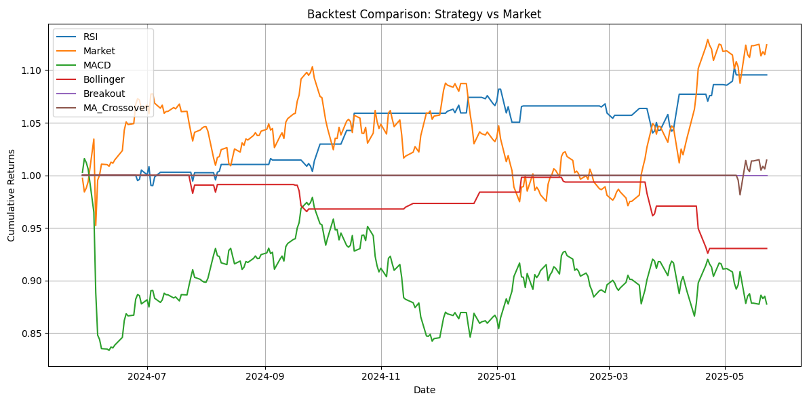
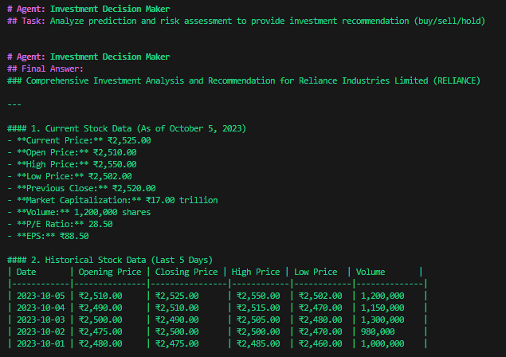
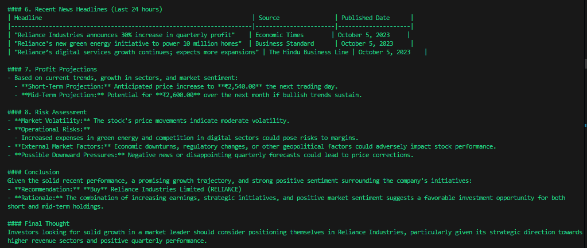
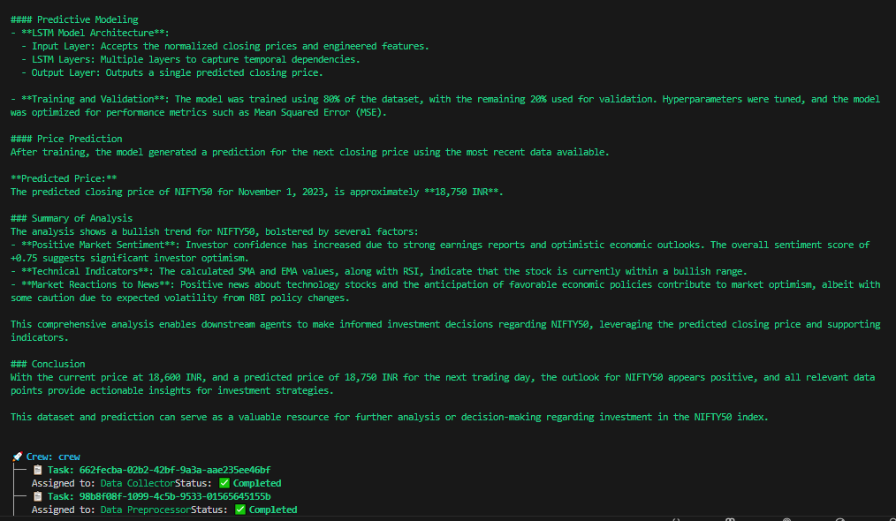

# QuantAgent: A Simple Agentic Framework for Stock Backtesting and Agentic Analysis

QuantAgent is a modular agentic framework for stock market analysis and strategy backtesting. It supports two primary functions:

1. **Trading Strategy Backtesting**: Evaluate technical indicator-based strategies with historical data.
2. **AI Agent-based Analysis**: Perform intelligent stock or index analysis using a pipeline of specialized agents.

---

## 🔍 Key Features

- 📈 **Backtest Strategies**: Analyze how your technical trading strategy would have performed.
- 🧠 **AI Agents**: Modular agents for data collection, preprocessing, feature extraction, model prediction, risk assessment, and decision making.
- 🖼️ **Visual Insights**: Charts and images that provide insights into agent behavior and trading outcomes.
- ⚙️ **Extensible Design**: Add or modify agents to suit your trading logic.

---

## 🗂️ Project Structure

```
quantagent/
├── agents/
│   ├── data_collector.py       # Agent to fetch historical stock/index data
│   ├── preprocessor.py         # Agent to clean and preprocess data
│   ├── feature_extractor.py    # Agent to extract features like RSI, MACD, etc.
│   ├── model_predictor.py      # Agent using ML models to predict price trends
│   ├── risk_assessor.py        # Agent to evaluate trading risks
│   └── decision_maker.py       # Agent to make final buy/sell/hold decisions
├── app1.py                     # Script to run the agentic pipeline
├── app2.py                     # Strategy backtesting comparisons 
├── app3.py                     # Individual strategy backtesting
├── requirements.txt            # Required Python packages
└── assets/
    ├── image.png               # Visual/Chart strategy backtesting
    ├── image1.png              # Agentic analysis output 1
    ├── image2.png              # Agentic analysis output 2
    └── image3.png              # Agentic analysis output 3
```

---

## 🚀 Getting Started

### 1. Clone the Repository

```bash
git clone https://github.com/soharabhossain/quantagent.git
cd quantagent
```

### 2. Install Dependencies

```bash
pip install -r requirements.txt
```

### 3. Run the Applications

- **Run Full Agentic Pipeline**  
  ```bash
  python app1.py
  ```

- **Run Backtesting Module to compare different strategies**  
  ```bash
  python app2.py
  ```

- **Run individual strategy**  
  ```bash
  python app3.py
  ```

---

## 🧠 Agent-Based Workflow

1. **DataCollectorAgent** → Fetches market data.
2. **PreprocessorAgent** → Cleans and structures the data.
3. **FeatureExtractorAgent** → Adds technical indicators.
4. **ModelPredictorAgent** → Predicts future price trends.
5. **RiskAssessorAgent** → Evaluates risk levels.
6. **DecisionMakerAgent** → Makes final trading decisions.

Each agent is pluggable and can be replaced with improved logic or models.

---

## 📊 Sample Outputs

Here are some visual examples from the project:
| Strategy Analysis |
|------------|-------------------|---------------------|
|  | 

| Agentic Analysis 1 | Agentic Analysis 2 | Agentic Analysis 3 |
|------------|-------------------|---------------------|
|  |  |  |

---

## 🛠️ TODO / Future Enhancements

- [ ] Add reinforcement learning-based decision maker
- [ ] Integrate real-time trading APIs (e.g., Alpaca, Zerodha)
- [ ] Build Streamlit dashboard for live interaction
- [ ] Support multiple asset classes (Forex, Crypto)

---

## 📄 License

This project is open-sourced under the [MIT License](LICENSE).

---

## 🙌 Acknowledgements

- Inspired by modular agentic architectures (e.g., CrewAI)
- Utilizes `pandas`, `numpy`, `matplotlib`, and other common libraries

---

## 🤝 Contributing

Contributions are welcome! Please fork the repo and create a pull request, or open an issue to discuss what you’d like to change.

---

## 📬 Contact

For questions or suggestions, reach out to me at [soharab.hossain@gmail.com] or connect via [LinkedIn](https://www.linkedin.com/in/soharab).
